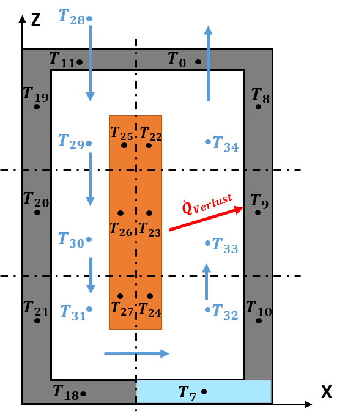
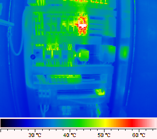
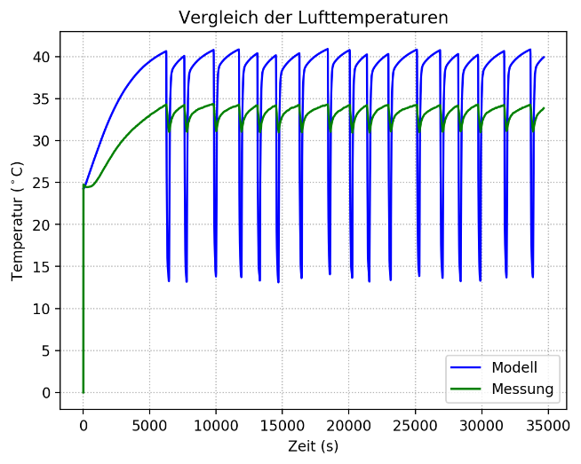
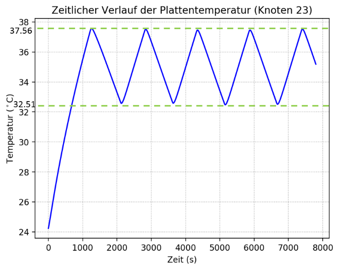

  
  

# Zusammenfassung
___
 
Im Betrieb weisen die elektronischen Komponenten eines Schaltschranks eine Temperaturerhöhung aufgrund der entstehenden Wärme durch Dissipation der elektrischen Energie auf. Diese Temperaturerhöhung kann schädlich für den Schaltschrank werden, daher wird dieser in der Regel mit Klimatechnik ausgerüstet. Im Rahmen unseres Projekts wurde ein instationäres Modell zur Berechnung der zeitabhängigen Temperaturverläufe innerhalb eines Schaltschrankes entwickelt und in Python® umgesetzt. Das Modell hat zwei Betriebsweisen:

1. **_Vorgegebene Kühlleistung_**: Die Kühlleistung des Dachkühlgeräts wird als eine Funktion der Zeit vorgegeben _Q(t)_.
 
 
2. **_Geregelte Kühlleistung des Dachkühlgeräts_**: Die Kühlleistung wird als eine Funktion der Plattentemperatur berechnet. Dabei darf sie weder unterhalb _32,5 °C_ noch oberhalb _37,5 °C_ liegen.
 
 

# Wichtigste Ergebnisse
___
### 1. Vorgegebene Kühlleistung
 

_Vergleich: gemessene (Grün) und berechnete Lufttemperaturen (Blau)_
 
 
Generell lässt sich sagen, dass für den Fall der vorgegebenen Kälteleitung, die modellierte Lufttemperatur und die gemessene Luft-temperatur ein ähnliches Verhalten vorzeigen, da die Spitzen der beiden Kurven zum fast selben Zeitpunkt erreicht werden konnten. Dabei ist wichtig festzuhalten, dass die Dauer der Aufheizphasen anhand des Modells gut dargestellt werden konnte.
 
 
Die Abweichungen zwischen den gemessenen und berechneten Werten sind von verschiedenen Faktoren abhängig. Ausschlaggebend sind u.a. durch die Auswahl der Lösungsverfahren, die am Modell getroffenen Annahmen, die Materialbeschaffenheit der Schaltschrankbestandteile, die Geometrie des Schaltschranks und die Wärmekapazitäten der Knotenelemente.
 
 
### 2. Geregelte Kühlleistung des Dachkühlgeräts

 

_Geregelter zeitlicher Verlauf der Plattentemperatur_
 
 

Die modellierte Temperatur bleibt innerhalb des angegebenen gewünschten Betriebsintervalls  (_32.5 °C < Plattentemperatur < 37.5 °C_). Dabei ist erwähnenswert, dass der Temperaturbereich leicht überschritten wird, was auf den Zeitvektor zurückzuführen ist, welcher durch den Solver erzeugt wird.

#### Dieses Projekt wurde im Rahmen einer Studienarbeit an [IGTE](<https://www.igte.uni-stuttgart.de/>) entwickelt. 